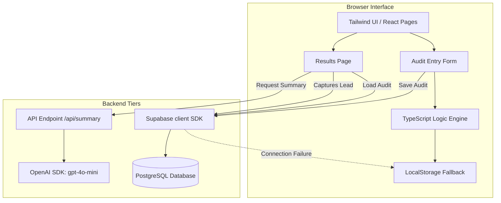

# Simple Architecture: AI Spend Audit

This document outlines how the **AI Spend Audit** code fits together. We kept the design simple so it is easy to run locally, debug, and package for reviews.

---

## 🏗️ How the App is Structured

The application is built using **Next.js 15.2 (App Router)** as a single-repo full-stack project.



---

## 🔄 Core Code Flows

### 1. The Audit Submission Flow
1. **Interactive Entry**: The user selects their AI tools, seats, and monthly bills on the React form at `/audit`.
2. **Instant Local Math**: The client-side `calculateAudit` engine handles all optimization logic locally. We did this because simple rule checks are fast (takes less than 2ms) and extremely easy to debug in code compared to writing complex backend worker tasks.
3. **Optimistic Database Save**: The form triggers `saveAuditToDb()`.
   * **With Supabase Keys**: Stores the tools list, recommendations, and total savings in a JSONB table named `audits` and returns a UUID.
   * **Without Keys (Offline mode)**: If the Supabase credentials aren't configured, the code catches the error and saves the payload directly as a serialized string in the browser's `localStorage`, returning a random draft ID.
4. **Immediate Redirection**: The browser redirects to `/results?id=<uuid>`, loading the data from the database or falling back to local storage.

### 2. The AI Executive Summary Flow
1. The page at `/results` detects the active audit.
2. It sends a `POST` request to `/api/summary` with the list of tools and savings.
3. **Server Output**: 
   * If `OPENAI_API_KEY` is present, it prompts `gpt-4o-mini` with a simple prompt and returns a 100-word summary.
   * **Simple Fallback**: If the key is missing or the API returns an error, the endpoint intercepts the failure and returns a programmatically templated summary fallback block. The dashboard loads successfully under any testing condition.

---

## 💾 Simple Database Schema

We use two simple, flat tables linked by UUID keys:

### `audits` Table
```sql
CREATE TABLE audits (
  id UUID PRIMARY KEY DEFAULT gen_random_uuid(),
  tools JSONB NOT NULL,                 -- List of user inputs (Tool, Plan, Seats, Spend, Use Case)
  recommendations JSONB NOT NULL,       -- Plan action recommendations
  total_savings NUMERIC NOT NULL,       -- Aggregated monthly savings
  created_at TIMESTAMP WITH TIME ZONE DEFAULT timezone('utc'::text, now()) NOT NULL
);
```

### `leads` Table
```sql
CREATE TABLE leads (
  id UUID PRIMARY KEY DEFAULT gen_random_uuid(),
  email TEXT NOT NULL,
  company_name TEXT NOT NULL,
  role TEXT NOT NULL,
  team_size INT NOT NULL,
  audit_id UUID REFERENCES audits(id) ON DELETE SET NULL,  -- Link back to calculation profile
  created_at TIMESTAMP WITH TIME ZONE DEFAULT timezone('utc'::text, now()) NOT NULL
);
```

---

## ⚠️ Honest Architectural Limitations

* **Hardcoded Pricing Matrix**: All baseline SaaS pricing models (ChatGPT at $20, Claude Pro at $20, etc.) are statically defined in the client-side pricing matrix dictionary. If these vendors change their pricing structures, the code will become outdated and require a manual developer update.
* **No Real-Time API Sync**: The engine relies entirely on manual user inputs rather than linking Plaid, Stripe, or Vercel keys. We made this trade-off because connecting finance APIs is incredibly tedious for an MVP, and manual entry avoids all security and OAuth trust issues.
* **JSONB Query Speed**: Storing active stacks inside a single JSONB column is simple to build, but it will slow down if we have to run complex query joins or global aggregations over thousands of records. If we scale, we'd need to extract tools into a dedicated, flat `audit_items` relational table.
